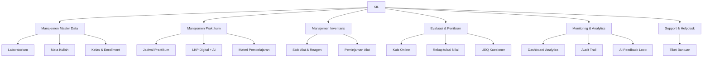
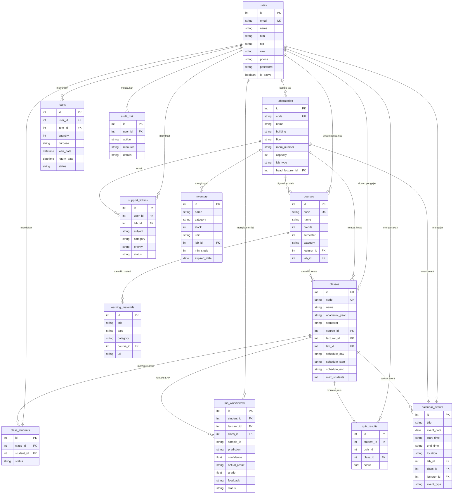

# 📋 Software Requirements Specification (SRS)
# SIL — Sistem Informasi Laboratorium Medis Cerdas

**Versi:** 1.0  
**Tanggal:** 22 Februari 2026  
**Institusi:** Politeknik Kesehatan Muhammadiyah Makassar  
**Program Studi:** D-IV Teknologi Laboratorium Medis  

---

## 1. Pendahuluan

### 1.1 Tujuan Dokumen
Dokumen ini mendefinisikan kebutuhan perangkat lunak untuk **Sistem Informasi Laboratorium Medis Cerdas (SIL)** — sebuah aplikasi web yang mengintegrasikan manajemen laboratorium, penjadwalan, inventaris, evaluasi mahasiswa, dan kecerdasan buatan untuk mendukung kegiatan praktikum laboratorium medis.

### 1.2 Ruang Lingkup Sistem
SIL mencakup:
- Manajemen data master (laboratorium, mata kuliah, kelas)
- Penjadwalan praktikum berdasarkan tahun ajaran dan semester
- Pengelolaan inventaris dan peminjaman alat laboratorium
- Lembar Kerja Praktikum (LKP) digital dengan prediksi AI
- Sistem kuis dan evaluasi mahasiswa
- Repositori materi pembelajaran
- Audit trail dan analytics untuk admin
- Sistem tiket bantuan (helpdesk)

### 1.3 Definisi, Akronim, dan Singkatan

| Istilah | Definisi                                   |
| ------- | ------------------------------------------ |
| SIL     | Sistem Informasi Laboratorium Medis Cerdas |
| LKP     | Lembar Kerja Praktikum                     |
| UEQ     | User Experience Questionnaire              |
| MK      | Mata Kuliah                                |
| TA      | Tahun Ajaran                               |
| SKS     | Satuan Kredit Semester                     |
| CRUD    | Create, Read, Update, Delete               |
| API     | Application Programming Interface          |
| FK      | Foreign Key                                |
| AI      | Artificial Intelligence                    |

### 1.4 Referensi
- IEEE 830-1998: Recommended Practice for Software Requirements Specifications
- Kurikulum D-IV Teknologi Laboratorium Medis, Poltekkes Muhammadiyah Makassar
- Standar Akreditasi Laboratorium (ISO 15189)

### 1.5 Overview Dokumen
- **Bab 2** — Deskripsi umum sistem
- **Bab 3** — Kebutuhan fungsional
- **Bab 4** — Kebutuhan non-fungsional
- **Bab 5** — Model data
- **Bab 6** — Antarmuka sistem

---

## 2. Deskripsi Umum

### 2.1 Perspektif Produk
SIL adalah aplikasi web mandiri (standalone) yang dapat diakses melalui browser. Sistem menggantikan proses manual pengelolaan laboratorium yang sebelumnya menggunakan formulir kertas, spreadsheet Excel, dan komunikasi via WhatsApp.

### 2.2 Fungsi Produk

### 2.3 Karakteristik Pengguna

| Aktor                  | Deskripsi                               | Jumlah Estimasi |
| ---------------------- | --------------------------------------- | :-------------: |
| **Mahasiswa**          | Peserta praktikum D-IV TLM semester 3-6 |   ~120 orang    |
| **Dosen / Instruktur** | Dosen pengampu mata kuliah praktikum    |    ~8 orang     |
| **Admin / Laboran**    | Pengelola laboratorium dan sistem       |    ~3 orang     |

### 2.4 Batasan Umum
- Sistem dioptimalkan untuk tampilan **mobile-first** (lebar ≤ 430px)
- Database menggunakan **SQLite** (single-file, tanpa server database terpisah)
- Autentikasi sederhana berbasis email + password (tanpa OAuth/SSO)
- AI prediksi bersifat simulasi (confidence score digenerate server-side)

### 2.5 Asumsi dan Dependensi
- Pengguna memiliki akses internet dan browser modern (Chrome/Firefox/Safari terbaru)
- Data master (lab, MK, kelas) diinput oleh admin di awal semester
- Jadwal praktikum mengikuti kalender akademik institusi

---

## 3. Kebutuhan Fungsional

### 3.1 Autentikasi & Otorisasi

| ID         | Kebutuhan                                                                     | Prioritas |
| ---------- | ----------------------------------------------------------------------------- | :-------: |
| FR-AUTH-01 | Sistem harus menyediakan halaman login dengan input email dan password        |  Tinggi   |
| FR-AUTH-02 | Sistem harus memvalidasi kredensial terhadap database users                   |  Tinggi   |
| FR-AUTH-03 | Sistem harus mengarahkan user ke dashboard sesuai role setelah login berhasil |  Tinggi   |
| FR-AUTH-04 | Sistem harus menyimpan sesi login di localStorage                             |  Tinggi   |
| FR-AUTH-05 | Sistem harus memblokir akses halaman terproteksi untuk user yang belum login  |  Tinggi   |
| FR-AUTH-06 | Sistem harus memblokir akses halaman yang tidak sesuai role pengguna          |  Tinggi   |
| FR-AUTH-07 | Sistem harus menyediakan fungsi logout yang menghapus sesi                    |  Tinggi   |

### 3.2 Dashboard

| ID         | Kebutuhan                                                                             | Role      | Prioritas |
| ---------- | ------------------------------------------------------------------------------------- | --------- | :-------: |
| FR-DASH-01 | Dashboard mahasiswa menampilkan: jumlah LKP pending, rata-rata kuis, peminjaman aktif | Mahasiswa |  Tinggi   |
| FR-DASH-02 | Dashboard mahasiswa menampilkan jadwal praktikum mendatang                            | Mahasiswa |  Tinggi   |
| FR-DASH-03 | Dashboard mahasiswa menampilkan daftar tugas tertunda                                 | Mahasiswa |  Sedang   |
| FR-DASH-04 | Dashboard dosen menampilkan: jumlah LKP menunggu validasi, jadwal mengajar            | Dosen     |  Tinggi   |
| FR-DASH-05 | Dashboard dosen menampilkan statistik performa mahasiswa per kelas                    | Dosen     |  Sedang   |
| FR-DASH-06 | Dashboard admin menampilkan: total user, lab, MK, kelas, inventaris, peminjaman aktif | Admin     |  Tinggi   |
| FR-DASH-07 | Dashboard admin menampilkan aktivitas audit terbaru                                   | Admin     |  Sedang   |
| FR-DASH-08 | Dashboard admin menampilkan peringatan stok rendah                                    | Admin     |  Sedang   |

### 3.3 Master Data — Laboratorium

| ID        | Kebutuhan                                                                                                                  | Role  | Prioritas |
| --------- | -------------------------------------------------------------------------------------------------------------------------- | ----- | :-------: |
| FR-LAB-01 | Admin dapat melihat daftar seluruh laboratorium beserta info gedung, kapasitas, dan kepala lab                             | Admin |  Tinggi   |
| FR-LAB-02 | Admin dapat menambahkan laboratorium baru dengan atribut: kode, nama, gedung, lantai, ruangan, kapasitas, tipe, kepala lab | Admin |  Tinggi   |
| FR-LAB-03 | API detail lab menampilkan daftar inventaris dan kelas yang menggunakan lab tersebut                                       | Admin |  Sedang   |
| FR-LAB-04 | Setiap laboratorium memiliki tipe (hematologi, mikrobiologi, kimia_klinik, parasitologi, imunologi, biokimia)              | Admin |  Tinggi   |

### 3.4 Master Data — Mata Kuliah

| ID       | Kebutuhan                                                                                                           | Role         | Prioritas |
| -------- | ------------------------------------------------------------------------------------------------------------------- | ------------ | :-------: |
| FR-MK-01 | Admin dapat melihat daftar mata kuliah beserta SKS, semester, dosen pengampu, dan lab                               | Admin, Dosen |  Tinggi   |
| FR-MK-02 | Admin dapat menambahkan mata kuliah baru dengan atribut: kode, nama, SKS, semester, kategori, deskripsi, dosen, lab | Admin        |  Tinggi   |
| FR-MK-03 | API detail MK menampilkan daftar kelas dan materi terkait                                                           | Admin, Dosen |  Sedang   |

### 3.5 Master Data — Kelas & Enrollment

| ID        | Kebutuhan                                                                                                                                       | Role         | Prioritas |
| --------- | ----------------------------------------------------------------------------------------------------------------------------------------------- | ------------ | :-------: |
| FR-KLS-01 | Admin dapat melihat daftar kelas beserta MK, dosen, lab, jadwal, dan jumlah mahasiswa terdaftar                                                 | Admin, Dosen |  Tinggi   |
| FR-KLS-02 | Admin dapat membuat kelas baru dengan atribut: kode, nama, tahun ajaran, semester, MK, dosen, lab, jadwal (hari, jam mulai, jam selesai), kuota | Admin        |  Tinggi   |
| FR-KLS-03 | Admin/Dosen dapat mendaftarkan (enroll) mahasiswa ke dalam kelas                                                                                | Admin, Dosen |  Tinggi   |
| FR-KLS-04 | API detail kelas menampilkan daftar mahasiswa terdaftar beserta NIM dan email                                                                   | Admin, Dosen |  Sedang   |
| FR-KLS-05 | Penjadwalan kelas harus menyertakan informasi tahun ajaran dan semester                                                                         | Admin        |  Tinggi   |
| FR-KLS-06 | Setiap kelas terhubung ke satu laboratorium untuk penempatan ruangan                                                                            | Admin        |  Tinggi   |

### 3.6 Lembar Kerja Praktikum (LKP)

| ID        | Kebutuhan                                                                                   | Role      | Prioritas |
| --------- | ------------------------------------------------------------------------------------------- | --------- | :-------: |
| FR-LKP-01 | Mahasiswa dapat mengisi dan men-submit LKP digital dengan data: sampel ID, hasil pengukuran | Mahasiswa |  Tinggi   |
| FR-LKP-02 | Sistem menampilkan prediksi AI dan confidence score untuk setiap LKP                        | Semua     |  Tinggi   |
| FR-LKP-03 | Dosen dapat memvalidasi LKP: memberi nilai (0-100), menulis feedback, mengubah status       | Dosen     |  Tinggi   |
| FR-LKP-04 | LKP terhubung ke kelas (class_id) untuk konteks praktikum                                   | Semua     |  Sedang   |
| FR-LKP-05 | Daftar LKP menampilkan nama mahasiswa, nama kelas, dan nama mata kuliah                     | Dosen     |  Sedang   |

### 3.7 Inventaris

| ID        | Kebutuhan                                                                                                               | Role  | Prioritas |
| --------- | ----------------------------------------------------------------------------------------------------------------------- | ----- | :-------: |
| FR-INV-01 | Sistem menampilkan daftar inventaris beserta nama lab terkait                                                           | Semua |  Tinggi   |
| FR-INV-02 | Setiap item memiliki atribut: nama, kategori, stok, satuan, lab, lokasi, stok minimum, tanggal kedaluwarsa              | Admin |  Tinggi   |
| FR-INV-03 | Sistem menampilkan indikator visual: TERSEDIA (hijau) jika stok > min_stock, STOK RENDAH (kuning) jika stok ≤ min_stock | Semua |  Sedang   |
| FR-INV-04 | Pencarian inventaris berdasarkan nama atau kategori                                                                     | Semua |  Sedang   |

### 3.8 Peminjaman Alat

| ID         | Kebutuhan                                                                      | Role  | Prioritas |
| ---------- | ------------------------------------------------------------------------------ | ----- | :-------: |
| FR-LOAN-01 | Pengguna dapat mengajukan peminjaman alat dengan menyebutkan tujuan penggunaan | Semua |  Tinggi   |
| FR-LOAN-02 | Stok inventaris berkurang otomatis sesuai jumlah peminjaman                    | Semua |  Tinggi   |
| FR-LOAN-03 | Stok bertambah kembali saat status peminjaman diubah ke `returned`             | Semua |  Tinggi   |
| FR-LOAN-04 | Daftar peminjaman menampilkan nama peminjam, nama alat, dan satuan             | Semua |  Sedang   |

### 3.9 Kuis & Evaluasi

| ID         | Kebutuhan                                                                              | Role             | Prioritas |
| ---------- | -------------------------------------------------------------------------------------- | ---------------- | :-------: |
| FR-QUIZ-01 | Sistem menampilkan daftar kuis dengan: judul, mata kuliah, jumlah soal, durasi, status | Semua            |  Tinggi   |
| FR-QUIZ-02 | Mahasiswa dapat mengerjakan kuis dengan timer aktif dan navigasi soal                  | Mahasiswa        |  Tinggi   |
| FR-QUIZ-03 | Hasil kuis tersimpan otomatis di database beserta class_id                             | Mahasiswa        |  Tinggi   |
| FR-QUIZ-04 | Mahasiswa dapat melihat riwayat hasil kuis                                             | Mahasiswa        |  Sedang   |
| FR-QUIZ-05 | Dosen dapat mengelola soal kuis (buat/edit)                                            | Dosen            |  Sedang   |
| FR-QUIZ-06 | Dosen dapat melihat rekapitulasi nilai per kelas                                       | Dosen            |  Sedang   |
| FR-QUIZ-07 | Tersedia halaman diskusi & pembahasan soal setelah kuis                                | Mahasiswa, Dosen |  Rendah   |

### 3.10 Materi Pembelajaran

| ID        | Kebutuhan                                                    | Role  | Prioritas |
| --------- | ------------------------------------------------------------ | ----- | :-------: |
| FR-MAT-01 | Sistem menampilkan daftar materi beserta mata kuliah terkait | Semua |  Tinggi   |
| FR-MAT-02 | Materi memiliki tipe: PDF, Video, Image                      | Semua |  Tinggi   |
| FR-MAT-03 | Setiap materi terhubung ke mata kuliah (course_id)           | Semua |  Sedang   |

### 3.11 Kalender & Penjadwalan

| ID        | Kebutuhan                                                                     | Role         | Prioritas |
| --------- | ----------------------------------------------------------------------------- | ------------ | :-------: |
| FR-CAL-01 | Sistem menampilkan jadwal praktikum dengan: tanggal, waktu, lab, kelas, dosen | Semua        |  Tinggi   |
| FR-CAL-02 | Dosen/Admin dapat membuat event baru dengan tipe: practicum, quiz, seminar    | Dosen, Admin |  Tinggi   |
| FR-CAL-03 | Jadwal terkoneksi ke lab_id dan class_id untuk penempatan ruangan             | Semua        |  Tinggi   |
| FR-CAL-04 | Tampilan kalender interaktif dengan navigasi minggu                           | Semua        |  Sedang   |

### 3.12 Audit Trail

| ID        | Kebutuhan                                                           | Role  | Prioritas |
| --------- | ------------------------------------------------------------------- | ----- | :-------: |
| FR-AUD-01 | Sistem mencatat setiap aksi pengguna: LOGIN, CREATE, UPDATE, DELETE | Admin |  Tinggi   |
| FR-AUD-02 | Log mencakup: user, aksi, resource, detail, timestamp               | Admin |  Tinggi   |
| FR-AUD-03 | Admin dapat melihat 50 log aktivitas terbaru                        | Admin |  Sedang   |

### 3.13 Analytics

| ID        | Kebutuhan                                                                                           | Role  | Prioritas |
| --------- | --------------------------------------------------------------------------------------------------- | ----- | :-------: |
| FR-ANA-01 | Dashboard analytics menampilkan: total user, lab, MK, kelas, inventaris, peminjaman, rata-rata kuis | Admin |  Tinggi   |
| FR-ANA-02 | Sistem mendeteksi item inventaris dengan stok rendah (stok ≤ min_stock)                             | Admin |  Sedang   |
| FR-ANA-03 | Dashboard AI Feedback menampilkan akurasi dan confidence score model prediksi                       | Admin |  Rendah   |

### 3.14 Support & Helpdesk

| ID        | Kebutuhan                                                                               | Role  | Prioritas |
| --------- | --------------------------------------------------------------------------------------- | ----- | :-------: |
| FR-SUP-01 | Pengguna dapat membuat tiket bantuan dengan subject, deskripsi, kategori, dan prioritas | Semua |  Tinggi   |
| FR-SUP-02 | Tiket dapat dikaitkan dengan lab tertentu (lab_id)                                      | Semua |  Sedang   |
| FR-SUP-03 | Admin dapat melihat dan mengelola seluruh tiket                                         | Admin |  Tinggi   |

### 3.15 Profil & UEQ

| ID        | Kebutuhan                                                        | Role  | Prioritas |
| --------- | ---------------------------------------------------------------- | ----- | :-------: |
| FR-PRO-01 | Pengguna dapat melihat dan mengedit profil: nama, email, telepon | Semua |  Tinggi   |
| FR-PRO-02 | Profil menampilkan NIM (mahasiswa) atau NIP (dosen/admin)        | Semua |  Sedang   |
| FR-UEQ-01 | Tersedia kuesioner UEQ untuk mengukur pengalaman pengguna        | Semua |  Rendah   |

---

## 4. Kebutuhan Non-Fungsional

### 4.1 Performa

| ID          | Kebutuhan                            | Target    |
| ----------- | ------------------------------------ | --------- |
| NFR-PERF-01 | Waktu respon API untuk operasi read  | ≤ 500ms   |
| NFR-PERF-02 | Waktu respon API untuk operasi write | ≤ 1000ms  |
| NFR-PERF-03 | Time to First Contentful Paint (FCP) | ≤ 2 detik |
| NFR-PERF-04 | Ukuran bundle JavaScript (gzipped)   | ≤ 500KB   |

### 4.2 Keamanan

| ID         | Kebutuhan                                                                    |
| ---------- | ---------------------------------------------------------------------------- |
| NFR-SEC-01 | Password tidak boleh disimpan dalam plaintext di production (harus di-hash)  |
| NFR-SEC-02 | Setiap halaman yang membutuhkan autentikasi harus dilindungi oleh auth guard |
| NFR-SEC-03 | Akses halaman berdasarkan role harus divalidasi di sisi client dan server    |
| NFR-SEC-04 | Semua input pengguna harus divalidasi untuk mencegah SQL injection           |

### 4.3 Usability

| ID         | Kebutuhan                                                                               |
| ---------- | --------------------------------------------------------------------------------------- |
| NFR-USE-01 | Antarmuka harus mengikuti desain mobile-first (optimasi untuk lebar ≤ 430px)            |
| NFR-USE-02 | Semua halaman harus memiliki loading state (skeleton) saat mengambil data               |
| NFR-USE-03 | Sistem harus memberikan feedback visual untuk setiap aksi pengguna (toast notification) |
| NFR-USE-04 | Navigasi antar halaman harus konsisten melalui komponen BottomNav per role              |
| NFR-USE-05 | Mendukung dark mode                                                                     |

### 4.4 Reliability

| ID         | Kebutuhan                                                                           |
| ---------- | ----------------------------------------------------------------------------------- |
| NFR-REL-01 | Sistem harus menampilkan pesan error yang informatif jika API gagal                 |
| NFR-REL-02 | Data inventaris harus konsisten: stok berkurang saat pinjam, bertambah saat kembali |
| NFR-REL-03 | Foreign key constraints harus dijaga di level database                              |

### 4.5 Maintainability

| ID         | Kebutuhan                                                                     |
| ---------- | ----------------------------------------------------------------------------- |
| NFR-MNT-01 | Kode sumber menggunakan arsitektur komponen React yang modular                |
| NFR-MNT-02 | API service terpisah dari komponen UI (file `api.js`)                         |
| NFR-MNT-03 | Database schema dapat di-reset dan di-seed ulang melalui script `init-db.cjs` |
| NFR-MNT-04 | Routing terpusat di `App.jsx`                                                 |

### 4.6 Portability

| ID         | Kebutuhan                                                                          |
| ---------- | ---------------------------------------------------------------------------------- |
| NFR-POR-01 | Aplikasi harus berjalan di browser Chrome, Firefox, Safari, dan Edge versi terbaru |
| NFR-POR-02 | Backend dapat berjalan di OS Windows, macOS, dan Linux                             |
| NFR-POR-03 | Tidak memerlukan instalasi database server terpisah (SQLite embedded)              |

---

## 5. Model Data

### 5.1 Entity Relationship Diagram (ERD)

### 5.2 Ringkasan Tabel

| No  | Tabel                | Jumlah Kolom | Tipe        |  FK   |
| --- | -------------------- | :----------: | ----------- | :---: |
| 1   | `users`              |      11      | Master      |   —   |
| 2   | `laboratories`       |      12      | Master      |   1   |
| 3   | `courses`            |      11      | Master      |   2   |
| 4   | `classes`            |      14      | Master      |   3   |
| 5   | `class_students`     |      5       | Pivot       |   2   |
| 6   | `inventory`          |      10      | Operasional |   1   |
| 7   | `loans`              |      8       | Operasional |   2   |
| 8   | `lab_worksheets`     |      12      | Operasional |   3   |
| 9   | `quiz_results`       |      7       | Operasional |   2   |
| 10  | `learning_materials` |      8       | Operasional |   1   |
| 11  | `calendar_events`    |      12      | Operasional |   3   |
| 12  | `audit_trail`        |      6       | Log         |   1   |
| 13  | `support_tickets`    |      9       | Operasional |   2   |

---

## 6. Antarmuka Sistem

### 6.1 Antarmuka Pengguna (UI)

| Halaman             | Path                  | Role Akses |
| ------------------- | --------------------- | :--------: |
| Login               | `/login`              |   Publik   |
| Dashboard Mahasiswa | `/dashboard/student`  | Mahasiswa  |
| Dashboard Dosen     | `/dashboard/lecturer` |   Dosen    |
| Dashboard Admin     | `/dashboard/admin`    |   Admin    |
| Inventaris          | `/inventory`          |   Semua    |
| Peminjaman Alat     | `/loans`              |   Semua    |
| LKP Digital         | `/lab/lkp`            |   Semua    |
| Validasi LKP        | `/lab/lkp/validate`   |   Dosen    |
| Kuis                | `/quiz/take`          |   Semua    |
| Hasil Kuis          | `/quiz/results`       |   Semua    |
| Diskusi Kuis        | `/quiz/discussion`    |   Semua    |
| Manajemen Kuis      | `/lecturer/quiz`      |   Dosen    |
| Rekap Nilai         | `/lecturer/recap`     |   Dosen    |
| Repositori Materi   | `/materials`          |   Semua    |
| Kalender Praktikum  | `/calendar`           |   Semua    |
| Analytics           | `/admin/analytics`    |   Admin    |
| Audit Trail         | `/admin/audit`        |   Admin    |
| AI Feedback         | `/admin/ai-feedback`  |   Admin    |
| Support             | `/support`            |   Semua    |
| Profil              | `/profile`            |   Semua    |
| Metrik Penelitian   | `/analytics`          |   Semua    |
| Kuesioner UEQ       | `/research/ueq`       |   Semua    |

### 6.2 Antarmuka API (REST)

- **Base URL:** `http://localhost:3001/api`
- **Format:** JSON
- **Metode:** GET, POST, PATCH
- **Total Endpoints:** 28

### 6.3 Antarmuka Hardware
- **Client:** Smartphone atau desktop dengan browser modern
- **Server:** Mesin dengan Node.js ≥ 18 dan SQLite 3

### 6.4 Antarmuka Software

| Komponen           | Teknologi              | Versi  |
| ------------------ | ---------------------- | ------ |
| Runtime            | Node.js                | ≥ 18.x |
| Frontend Framework | React                  | 18.x   |
| Build Tool         | Vite                   | 5.x    |
| CSS Framework      | Tailwind CSS           | 3.x    |
| Backend Framework  | Express.js             | 5.x    |
| Database           | SQLite                 | 3.x    |
| Router             | React Router DOM       | 6.x    |
| Icons              | Material Icons Round   | Latest |
| Font               | Manrope (Google Fonts) | Latest |

---

## 7. Lampiran

### 7.1 Daftar Seed Data

| Data                                  | Jumlah |
| ------------------------------------- | :----: |
| Users (admin, dosen, mahasiswa)       |   7    |
| Laboratorium                          |   6    |
| Mata Kuliah                           |   8    |
| Kelas                                 |   10   |
| Enrollment Mahasiswa                  |   16   |
| Inventaris (alat, reagen, consumable) |   12   |
| Peminjaman                            |   4    |
| LKP                                   |   5    |
| Hasil Kuis                            |   6    |
| Materi Pembelajaran                   |   7    |
| Jadwal/Event                          |   7    |
| Audit Trail                           |   7    |
| Tiket Support                         |   4    |

### 7.2 Riwayat Revisi Dokumen

| Versi | Tanggal          | Perubahan                                                                              |
| ----- | ---------------- | -------------------------------------------------------------------------------------- |
| 1.0   | 22 Februari 2026 | Dokumen awal — 60 kebutuhan fungsional, 17 kebutuhan non-fungsional, 13 tabel database |
